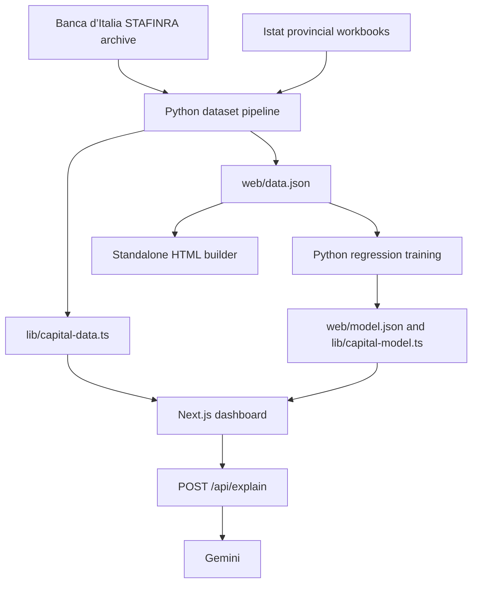

# Capital X-Ray

**Compare economic momentum with financing across Lombardy.**

Capital X-Ray is a fintech hackathon prototype that combines Banca d’Italia lending and deposit data with Istat business indicators. It helps regional banks, investment funds and policymakers identify province–sector combinations that warrant further investigation.

The app includes an interactive comparison grid, an expected-credit regression benchmark, Gemini explanations and a hypothetical €1 million allocation simulator. Precomputed data and model outputs are included, so you can run the dashboard without rebuilding the Python pipeline.

## Contents

- [Features and data coverage](#what-you-can-explore)
- [Quick start](#quick-start)
- [Demo walkthrough](#demo-walkthrough)
- [Architecture](#architecture)
- [Dashboard metrics](#how-the-dashboard-scores-work)
- [Expected-credit benchmark](#expected-credit-benchmark)
- [Gemini explanations](#gemini-explanations)
- [Allocation simulator](#allocation-simulator)
- [Rebuild the data and model](#rebuild-the-data-and-model)
- [Repository layout](#repository-layout)
- [Checks and troubleshooting](#checks-and-troubleshooting)
- [Current limitations](#current-limitations)
- [Shared codebase memory](#shared-codebase-memory)

## What you can explore

- **Capital X-Ray Matrix:** filter, search and sort province–sector cards by economic momentum, financing support or their difference.
- **Why is this highlighted?:** inspect six underlying indicators and an explanation generated by Gemini, with a template fallback when the API fails.
- **Expected-Credit Benchmark:** compare observed lending with a regression benchmark, inspect validation metrics and select cells in the ranked gap chart.
- **€1 million simulator:** switch between growth, underfinanced areas, liquidity-based risk proxies and geographic diversification.
- **Offline demo:** open a self-contained HTML version with the grid, template explanations and a rules-based simulator.

The current dataset covers **five provinces × three sectors × six years = 90 observations**, summarized into **15 province–sector cells**. A cell, also called a cluster in the UI, represents an aggregate sector in a province.

| Coverage | Included values |
|---|---|
| Region | Lombardy, Italy |
| Provinces | Milano, Brescia, Bergamo, Monza e della Brianza, Varese |
| Macro-sectors | Industria (industry), Costruzioni (construction), Servizi (services) |
| Historical period | 2015–2020 |

The five provinces were the scope chosen in the hackathon plan. The project does not establish that this selection statistically represents all of Lombardy.

## Quick start

### Run the main app

Install **Node.js and npm**. Node.js 22 or newer is a suitable choice for the versions recorded in the [npm lockfile](capital-x-ray/package-lock.json). Python and the original data downloads are optional for this path.

For a new checkout, clone the repository with Git:

```sh
git clone https://github.com/al-rafi-DSC/Capital_XRay.git
cd Capital_XRay
```

From the repository root:

```sh
cd capital-x-ray
npm ci
npm run dev
```

Open the local address printed by Next.js, normally **http://localhost:3000**.

To use another port:

```sh
npm run dev -- --port 4300
```

### Enable Gemini explanations

Create or update `capital-x-ray/.env.local` with your own key:

```dotenv
GEMINI_API_KEY=your_gemini_api_key
```

Restart the development server after changing the environment file. The key is read by the server route and should remain in the ignored `.env.local` file.

Without a configured key, the dashboard, benchmark and simulator still work. The explanation panel uses its **FALLBACK** template after the API request fails. A successful model response changes the label to **GEMINI LIVE**.

| Environment variable | Purpose |
|---|---|
| `GEMINI_API_KEY` | Enables server-side Gemini calls for explanations |
| `DISABLE_HMR` | Setting it to `true` disables development file watching in the current Next.js configuration |
| `APP_URL` | Present in the inherited AI Studio example file, but unused by the current app code |

### Build and serve locally

Run these commands inside `capital-x-ray/`:

```sh
npm run build
npm run start
```

The main app needs a Node.js server for `/api/explain`. It imports the precomputed TypeScript data directly and does not require a database or a separate Flask/FastAPI service.

### Open the offline demo

Open [web/capital-x-ray.html](web/capital-x-ray.html) in a browser. Its data, styles and scripts are embedded in the file.

The offline version has the grid, template explanations and simulator. The expected-credit model panel and live Gemini calls are available in the main Next.js app.

## Demo walkthrough

1. **Start with the overview.** Explain the five-province, three-sector scope and historical 2015–2020 period.
2. **Explore the matrix.** Keep the filters on All and sort by Most Underfinanced. Select **Brescia / Costruzioni** to examine the included dataset’s **−27-point** weighted gap.
3. **Read the explanation.** Scroll to **Why is this highlighted?** and compare the narrative with the six sub-scores. The source label distinguishes **GEMINI LIVE** from **FALLBACK**.
4. **Compare the statistical benchmark.** In **Expected-Credit Benchmark**, select **Varese / Costruzioni**. The included model reports a six-year learned gap of **−27.1%** and **z = −1.91**. This is a separate measure from the weighted gap on the matrix.
5. **Change the allocation objective.** Switch between **Underfinanced Areas**, **Growth** and **Diversification** to see the hypothetical portfolio change. Donut and Bar show the same allocation in different formats.

Selecting a cell updates its detailed analysis, but you may need to scroll to the relevant section. The benchmark and simulator use precomputed data, so you can continue exploring them while a Gemini response is pending.

## Architecture



| Layer | Technologies |
|---|---|
| Frontend | Next.js 15, React 19, TypeScript |
| Styling and charts | Tailwind CSS 4, Recharts, Lucide icons |
| Explanation endpoint | Next.js route handler, Google Gen AI SDK |
| Data preparation | Python, pandas, openpyxl |
| Regression and validation | NumPy, pandas, scikit-learn |
| Data delivery | Generated JSON and TypeScript modules |

## How the dashboard scores work

The pipeline calculates compound annual growth rates between 2015 and 2020. It then normalizes each underlying indicator across the 15 cells using min–max scaling:

```text
indicator score = 100 × (value − minimum) / (maximum − minimum)
```

If an indicator has no variation, every cell receives 50. A score of 0 means the lowest value in this comparison set; it does not necessarily mean zero growth, zero lending or no liquidity.

### Card metrics

| UI metric | Calculation |
|---|---|
| Economic Strength | 40% turnover-growth score + 30% business-establishment-growth score + 30% employment-growth score |
| Business Momentum | Normalized growth in the number of local business establishments |
| Credit Support | 50% credit-growth score + 30% deposit-growth score + 20% liquidity score |
| Liquidity Index | Normalized ratio of provincial deposits to sector lending in the final year |

The underlying `sectorPerformance` score uses employment growth. The `businesses` field comes from Istat’s **unità locali**, or local business establishments. Loan values represent outstanding lending. Deposits remain province-level and cover a broader population than businesses in the selected sector.

### Capital Gap Score

```text
Capital Gap Score = Financing Support − Economic Momentum
```

| Gap | UI classification | Interpretation |
|---|---|---|
| `gap <= -15` | Underfinanced / Capital Deficit | Financing-support indicators trail economic momentum |
| `-15 < gap < 15` | Balanced | Scores fall within the chosen balance range |
| `gap >= 15` | Overheated / Credit Surplus | Financing-support indicators exceed economic momentum |

These are index-point differences. The thresholds and weights are prototype assumptions. The labels identify potential mismatches; establishing unmet borrowing demand, excessive lending or default risk requires additional evidence.

For example, the included dataset shows **Brescia construction at −27** and **Monza e della Brianza industry at +60**. The pipeline computes the gap before rounding, so subtracting the rounded component scores can differ by one point.

**Sign convention:** the implementation uses negative gaps for underfinancing. This reverses the convention in the original [product requirements document](Capital_X-Ray_PRD.md).

## Expected-credit benchmark

[pipeline/train_model.py](pipeline/train_model.py) fits a linear regression on the 90-row historical panel:

```text
log(loans) ~ log(turnover) + log(business establishments) + sector + year trend
```

For each cell, the pipeline averages its log residuals across the available years. It converts that mean to a percentage with `100 × (exp(mean residual) − 1)` and computes a z-score using the spread of cell-level mean residuals. Cells with `abs(zScore) >= 1.5` receive an anomaly flag.

The benchmark measures lending relative to the fitted relationships in the sample. The weighted Capital Gap Score emphasizes growth and financing indicators. Their rankings can differ.

### Recorded validation results

The included [web/model.json](web/model.json) reports:

| Metric | Value |
|---|---:|
| Training observations | 90 |
| Province–sector cells | 15 |
| In-sample R² on log lending | 0.960 |
| Leave-one-cell-out R² on log lending | 0.920 |
| Leave-one-cell-out R² on log lending per establishment | 0.865 |
| Sector-only baseline R² | −0.109 |

**Leave-one-cell-out** validation holds out all six years of one province–sector cell in each fold. This checks predictions for an unseen cell, rather than future years. An R² of 0.920 is a goodness-of-fit statistic, not “92% prediction accuracy.”

The displayed cell benchmarks come from the model fitted on the complete panel. The actual-versus-expected lending bars show **2020**, while `creditGapPct` summarizes **2015–2020**. They therefore need not yield the same percentage. The displayed “Typical Error” derives from in-sample residual dispersion and is not a prediction interval or an out-of-sample error estimate.

## Gemini explanations

The client sends the selected row to [`POST /api/explain`](capital-x-ray/app/api/explain/route.ts). The route adds the stored model benchmark by cell ID and requests structured JSON from Gemini containing:

- `headline`, `verdict` and `narrative`;
- `driverPoints` and `recommendation`;
- `modelInsight`, plus response metadata `source` and `model`.

The prompt requests explanations grounded in the provided numbers. The implementation tries a configured sequence of Gemini models, retries transient capacity errors and temporarily skips models that return quota errors. Model IDs and fallback behavior live in `app/api/explain/route.ts`.

Missing credentials return HTTP **503**. Generation or request-processing failures return **502**. The client retains its template explanation after failure and shows a loading state while the request is pending.

The route currently accepts score fields from the client, while looking up the regression benchmark server-side. Prompt constraints and the limited output checks do not guarantee factual or causal accuracy. Production use would need stronger input validation, request controls and explanation validation.

## Allocation simulator

The simulator uses deterministic rules on the weighted scores. It ranks the full 15-cell dataset, chooses four cells and assigns relative weights before rounding the displayed amounts.

| Objective | Ranking rule |
|---|---|
| Underfinanced Areas | `-capitalGapScore` |
| Growth | `economicMomentum - 0.3 × financingSupport` |
| Low-Risk | `liquidity + depositStrength - abs(capitalGapScore)` |
| Diversification | `economicMomentum - 0.2 × abs(capitalGapScore)`, then at most one cell per province |

The regression model does not decide these allocations. The simulator’s rationale is templated, and its budget is hypothetical. Matrix filters change the displayed cards without changing the simulator’s input universe or recalculating the normalized scores.

## Rebuild the data and model

Run the following steps from the **repository root**. Rebuilding overwrites the generated JSON, TypeScript modules and offline HTML. Keep these outputs together so the frontend and benchmark use matching cell IDs and data.

### 1 Prepare Python

Create a virtual environment:

```sh
python -m venv .venv
```

Activate it in PowerShell:

```powershell
.\.venv\Scripts\Activate.ps1
```

Or in macOS/Linux shells:

```sh
source .venv/bin/activate
```

Install the packages used by the pipeline:

```sh
python -m pip install pandas openpyxl numpy scikit-learn
```

The project does not currently pin Python dependencies. If PowerShell blocks activation, use `.\.venv\Scripts\python.exe` in place of `python` in the install and pipeline commands.

### 2 Obtain the source data

Use the source pages and archive descriptions in [data/DATA_SOURCES.md](data/DATA_SOURCES.md). Place the two required downloads at these exact paths:

```text
data/raw/banca_finanziamenti_raccolta.zip
data/raw/istat_frame_sbs_territoriale_2023_tavole.zip
```

Extract the Istat archive:

```sh
python -m zipfile -e data/raw/istat_frame_sbs_territoriale_2023_tavole.zip data/extracted/istat_frame_sbs_2023
```

Check that the extracted directory contains one workbook for each year from 2015 through 2020, following this pattern:

```text
data/extracted/istat_frame_sbs_2023/Tavole/Province 2015-2020/
    Frame territoriale - Province - Anno 2015.xlsx
    ...
    Frame territoriale - Province - Anno 2020.xlsx
```

The pipeline reads the nested Banca d’Italia ZIP files directly, so that archive does not need manual extraction. `data/raw/` and `data/extracted/` are excluded from Git.

The current scoring pipeline uses STAFINRA and Istat. The retained STACORIS, ECB SAFE, Lombardia auxiliary files and report workbooks in the repository root are not inputs to this pipeline.

### 3 Run the pipeline in order

```sh
python pipeline/build_dataset.py
python pipeline/train_model.py
python pipeline/build_standalone.py
```

| Script | Outputs |
|---|---|
| `build_dataset.py` | `web/data.json`, `capital-x-ray/lib/capital-data.ts` |
| `train_model.py` | `web/model.json`, `capital-x-ray/lib/capital-model.ts` |
| `build_standalone.py` | `web/capital-x-ray.html` |

Change source transformations or formulas in the Python scripts, then regenerate. Avoid manually editing generated TypeScript modules. Rebuild the Next.js app again when serving a production build.

### Generated data format

`web/data.json` contains `meta` and a `cells` array. Each cell includes its ID, province, sector, composite scores, six normalized `subScores`, raw values and an annual `series`. Monetary fields ending in `KEUR` or `_kEUR` use **thousands of euros**. Raw growth fields ending in `GrowthPct` are annual compound growth rates. `creditIntensityPct` is the final-year loans-to-turnover ratio.

`web/model.json` contains model metadata, metrics, coefficients, the intercept and cell-level benchmarks. The dashboard imports the corresponding TypeScript exports instead of fetching these JSON files at runtime.

## Repository layout

```text
Capital_X-Ray_PRD.md              Original product plan
capital-x-ray/
  app/page.tsx                   Dashboard and allocation rules
  app/api/explain/route.ts        Gemini explanation endpoint
  app/globals.css                Global styles
  lib/capital-data.ts             Generated scores and historical data
  lib/capital-model.ts            Generated regression outputs
  .env.example                   Environment variable example
  package.json                   Frontend scripts and dependencies
data/
  DATA_SOURCES.md                 Source catalog and download locations
  raw/                           Local source downloads, ignored by Git
  extracted/                     Local extracted files, ignored by Git
pipeline/
  build_dataset.py               Read, join and score the source data
  train_model.py                 Fit and validate the regression
  build_standalone.py            Generate the offline demo
web/
  data.json                      Generated dataset
  model.json                     Generated model artifact
  capital-x-ray.html             Self-contained offline demo
.codebase-memory/                Shared code graph artifact
```

## Checks and troubleshooting

Run frontend checks inside `capital-x-ray/`:

```sh
npm run lint
npm run build
```

The Next.js configuration skips ESLint during a production build, so run lint separately. TypeScript build errors remain enabled. The repository currently has no dedicated automated test suite.

For a manual check, select **Brescia / Costruzioni**, confirm the weighted gap is **−27**, inspect the explanation source label, select **Varese / Costruzioni** in the benchmark and switch simulator objectives. The included model artifact gives Varese construction a six-year learned gap of **−27.1%** with **z = −1.91**. Regenerated datasets may change these reference values.

| Symptom | Check |
|---|---|
| Port 3000 is unavailable or reports a bind-permission error | Use `npm run dev -- --port 4300` and open the printed address |
| Explanation shows `FALLBACK` | Check the server environment, restart after key changes, and inspect terminal logs for authentication, model availability or quota errors |
| Changes do not appear during development | Confirm `DISABLE_HMR` is not set to `true` |
| Pipeline reports missing files | Check archive names and the extracted Istat workbook paths above |
| Score data and model output disagree after editing data | Rerun dataset generation, model training and standalone generation in order |
| `npm run start` cannot find a build | Run `npm run build` first |

## Current limitations

- **Historical coverage:** the app uses 2015–2020 data. The “Live Feed” label does not indicate a live economic data feed.
- **Relative indicators:** results depend on the comparison set, manually selected weights and thresholds. Province-level deposits make liquidity a coarse proxy for a sector’s financial position.
- **Percentage labels:** card footers currently attach `%` to normalized turnover and credit scores. Read those values as indices. Use raw growth fields for actual percentage growth.
- **Different time summaries:** benchmark lending bars show the final year, while learned gap percentages summarize all six years. Some AI/template wording does not fully distinguish these summaries.
- **Illustrative finance labels:** “Target Yield” and “Risk” derive from simple rules, without a validated return or credit-risk model. Simulator amounts and percentages round independently and may not sum exactly to €1 million or 100%.
- **Explanation grounding:** prompts restrict numeric claims, but generated and template narratives can still overstate causes or lending implications.
- **Small sample:** 90 repeated observations from 15 cells support a prototype peer comparison. Borrower quality, credit demand and affordability remain unobserved.

Planned improvements include more recent and broader data, sensitivity checks for the scoring weights, validation on new samples, clearer UI units, exact allocation rounding and stronger API controls.

## Shared codebase memory

This repository uses `codebase-memory-mcp` with project name **`a2b-games`**. Prefer its `search_graph`, `trace_path` and `get_code_snippet` tools for code discovery. Architecture decisions belong in the shared ADR accessed through `manage_adr`.

When the local CLI is available, inspect or refresh the index from the repository root:

```sh
codebase-memory-mcp cli get_architecture --project a2b-games
codebase-memory-mcp cli index_repository --repo-path . --name a2b-games --mode full --persistence true
```

Check the index status and [artifact metadata](.codebase-memory/artifact.json) before relying on the graph. The committed artifact may lag behind the working tree, particularly after new files or failed refreshes. If graph results are incomplete, inspect the relevant source files directly.
